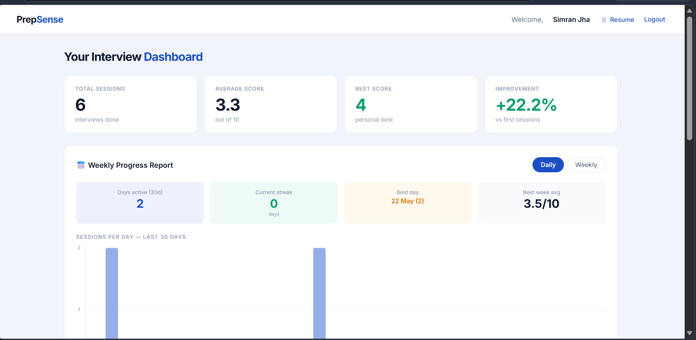
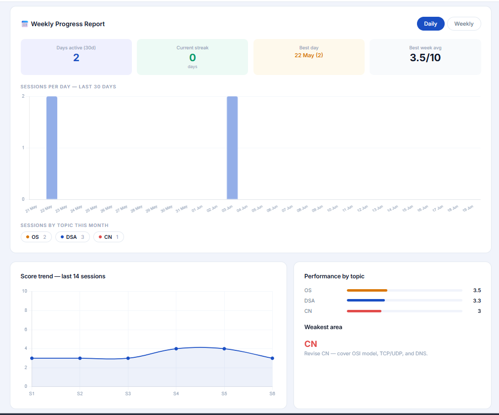
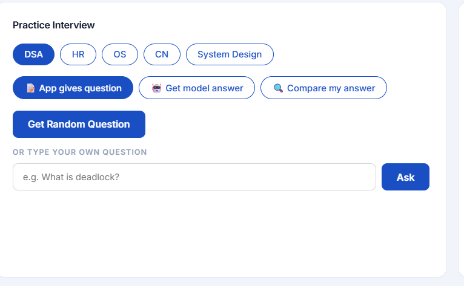
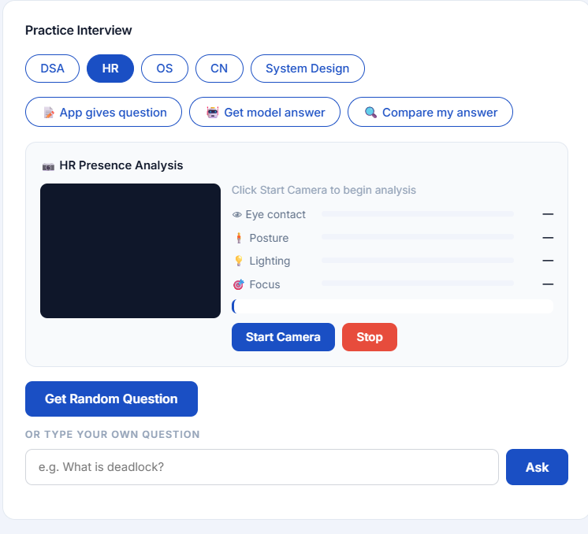

# PrepSense – Intelligent Mock Interview & Performance Analytics Platform

## Overview

PrepSense is a full-stack interview preparation platform designed to help students improve their technical and HR interview performance through structured mock interviews, automated feedback, performance analytics, and webcam-based interview monitoring.

The platform enables users to practice interview questions across multiple domains, evaluate responses, identify weak areas, and track progress through interactive dashboards.

---

## Live Demo

### Frontend
https://iridescent-paletas-a2a6f4.netlify.app

### Backend
https://prepsense-a098.onrender.com

---

## Screenshots

### Landing Page


### Dashboard



### Analytics Dashboard



### Interview Module



### Webcam Analysis



### Resume Analyzer


### Personalized Feedback


---

## Features

### Authentication System
- User Registration and Login
- User Profile Management
- Session Tracking

### Mock Interview Platform
- DSA Interview Practice
- Operating Systems Interview Practice
- Computer Networks Interview Practice
- HR Interview Preparation
- System Design Interview Practice

### Intelligent Answer Evaluation
- Rule-based answer assessment
- Keyword coverage analysis
- Automated scoring
- Personalized feedback generation

### Performance Analytics Dashboard
- Total Sessions Tracking
- Average Score Analysis
- Weekly Progress Reports
- Topic-wise Performance Analysis
- Weak Area Detection
- Session History

### Resume Analysis
- Resume Upload
- Resume Assessment
- Improvement Suggestions

### Webcam-Based Interview Monitoring
- Eye Contact Analysis
- Posture Monitoring
- Focus Tracking
- Lighting Assessment

### Personalized Recommendations
- Weak Topic Identification
- Improvement Suggestions
- Progress-Based Guidance

---

## Tech Stack

### Frontend
- HTML5
- CSS3
- JavaScript

### Backend
- Python
- FastAPI

### Database
- SQLite
- SQLAlchemy ORM

### Deployment
- Netlify
- Render

---

## System Architecture

```text
User
  │
  ▼
Frontend (HTML, CSS, JavaScript)
  │
  ▼
REST API Calls
  │
  ▼
FastAPI Backend
  │
  ├── Authentication Module
  ├── Interview Module
  ├── Resume Analysis Module
  ├── Analytics Module
  └── Feedback Engine
  │
  ▼
SQLAlchemy ORM
  │
  ▼
SQLite Database
```

---

## Workflow

1. User logs into the platform.
2. User selects an interview category.
3. Questions are retrieved from the backend.
4. User submits answers.
5. The evaluation engine analyzes responses.
6. Scores and feedback are generated.
7. Results are stored in the database.
8. Analytics dashboards are updated.
9. Personalized recommendations are displayed.

---

## My Contribution

### Frontend Developer

This project was developed as a team project, and my primary contribution was frontend development.

### Responsibilities

- Designed and developed responsive user interfaces using HTML, CSS, and JavaScript.
- Built the Landing Page, Login Page, Signup Page, Dashboard, Interview Interface, Analytics Screens, Resume Analyzer UI, and Personalized Feedback screens.
- Developed interactive dashboards displaying interview scores, progress reports, topic-wise performance, and session analytics.
- Integrated frontend components with backend REST APIs.
- Implemented webcam-based interview monitoring interfaces.
- Handled client-side validation and user interactions.
- Improved responsiveness across desktop and mobile devices.
- Contributed to frontend testing, debugging, and deployment.

### Technologies Used By Me

- HTML5
- CSS3
- JavaScript
- REST API Integration
- Netlify Deployment

---

## Key Learning Outcomes

- Frontend Architecture
- Responsive Web Design
- API Integration
- Dashboard Development
- User Experience Design
- Frontend Deployment
- Debugging and Testing
- Working with REST APIs

---

## Challenges Faced

- Integrating frontend interfaces with backend APIs.
- Designing responsive dashboards for different screen sizes.
- Implementing webcam-based monitoring interfaces.
- Managing dynamic interview data and analytics visualizations.
- Ensuring smooth user experience across multiple modules.
- Deploying frontend and backend services separately.

---

## Future Enhancements

- AI-powered answer evaluation using LLMs.
- Speech analysis and communication feedback.
- Resume-job description matching.
- Personalized learning roadmaps.
- PostgreSQL integration.
- JWT authentication.
- AWS deployment.
- Real-time voice interviews.
- Company-specific interview preparation tracks.

---

## Project Motivation

Interview preparation often lacks structured feedback and progress tracking. PrepSense was developed to bridge this gap by providing an interactive platform where students can practice interviews, receive feedback, monitor their progress, and improve their readiness for technical and HR interviews.
